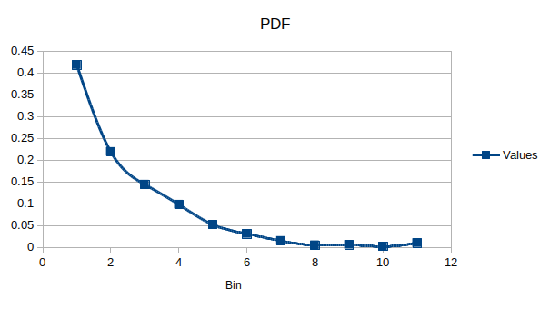
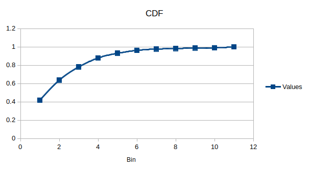

## Question 1

See `./code/q1/src/main.rs`. You can [install Rust](https://doc.rust-lang.org/stable/book/installing-rust.html) and run it with `cargo run` from the `./code/q1/` directory.

```
Bins: [106, 122, 99, 113, 84, 103, 89, 80, 101, 103]
Chi Squared result: 14.860000000000001, expected: 16.9
Accept
```

## Question 2

See `./code/q2/src/main.rs`. You can [install Rust](https://doc.rust-lang.org/stable/book/installing-rust.html) and run it with `cargo run` from the `./code/q2/` directory.

```
--- Beginning KS Test ---
d_plus: -0.02
d_minus: 0.28
d_max: 0.28
Critical Value: 0.41
Choice: Accept.
--- Beginning Chi Squared Test ---
Instance bins: [101, 108, 119, 87, 88, 138, 89, 73, 101, 96]
Chi Squared Result: 30.5
Critical Value: 16.9
Choice: Reject.
```

## Question 3

```
a=11, m=16, x_0=7 -> [7, 13, 15, 5]
a=11, m=16, x_0=8 -> [8]
a=7, m=16, x_0=7 -> [7, 1]
a=7, m=16, x_0=8 -> [8]
```

See `./code/q3/src/main.rs` for procedure.

This method is not good for generating random numbers without using the increment. The maximum period is the `modulus` so it isn't achieved.

## Question 4

Computing the CDF:

$$ F(x) =
    \begin{cases}
        \int_{-\infty}^x e^{2y}dy                       & if -\infty < x \leq 0 \\
        \int_{-\infty}^0 e^{2y}dy + \int_0^x e^{-2y}dy  & if 0 < x < \infty
    \end{cases}
$$
$$ F(x) =
    \begin{cases}
        \frac{e^{2x}}{2}                       & if -\infty < x \leq 0 \\
        1 - \frac{e^{-2x}}{2}                  & if 0 < x < \infty
    \end{cases}=R
$$

Solving for $x$ in terms of $R$.

* When $-\infty < x \leq 0$ then $0 < R \leq \frac{1}{2}$.
* When $0 < x < \infty$ then $\frac{1}{2} < R < 1$.

$$ x =
    \begin{cases}
        \frac{\ln{(2R)}}{2}                       & if 0 < R \leq \frac{1}{2} \\
        \frac{ -\ln{(2-2R)} }{2}                  & if \frac{1}{2} < R < 1
    \end{cases}
$$


## Question 5

Calculating $M$:
$$ 1 + (M+1)m \le N $$
$$ 1 + (M+1)3 \le 20 $$
$$ M \le \frac{20 - 1}{3} - 1 $$
$$ M = \frac{16}{3} \approx 5 $$

Every third number consists of: `[0.594, 0.055, 0.262, 0.442, 0.227, 0.825, 0.929]`

$$ s = (0.594)(0.055) + (0.055)(0.262) + (0.262)(0.442) + (0.442)(0.227) + (0.227)(0.825) + (0.825)(0.929) $$
$$ \rho_{13} = \frac{1}{5+1}(s) - 0.25 = -0.047180\bar3 $$
$$ \sigma_{\rho_{13}} = \frac{ \sqrt{13(5)+7} }{ 12((5)+1) } = \frac{1}{6\sqrt{2}} $$

$\therefore$ Low random numbers tend to be followed by high ones, and vice versa.

$$ Z_0 = \frac{-0.047180\bar3}{ \frac{1}{6\sqrt{2}} } = -0.400338 $$

## Question 6

See `./code/q6/src/main.rs`. You can [install Rust](https://doc.rust-lang.org/stable/book/installing-rust.html) and run it with `cargo run` from the `./code/q6/` directory.

```
0.17412993930787957
0.9304329461888953
0.24449586846746044
0.22509541311260708
0.0925020326124768
1.62175663077248
1.0929600257008332
0.2636666389335839
1.2809448866315418
0.5906448251216201
```

## Question 7

See `./code/q7/src/main.rs`. You can [install Rust](https://doc.rust-lang.org/stable/book/installing-rust.html) and run it with `cargo run` from the `./code/q7/` directory.

```
Generated bins: [
    418,
    219,
    144,
    98,
    52,
    31,
    15,
    5,
    6,
    2,
    10
]
Normalized bins: [
    0.418,
    0.219,
    0.144,
    0.098,
    0.052,
    0.031,
    0.015,
    0.005,
    0.006,
    0.002,
    0.01
]
```

Resulting in the following plots:

\

\


The generated numbers are coarsely exponential.
